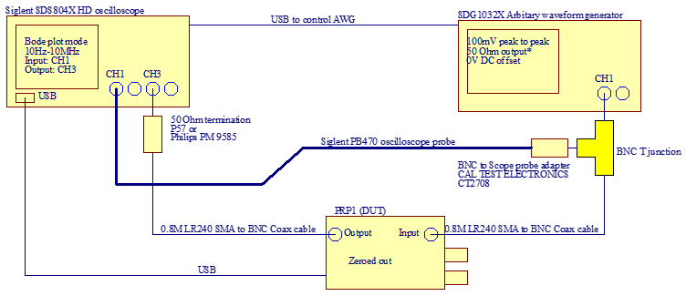
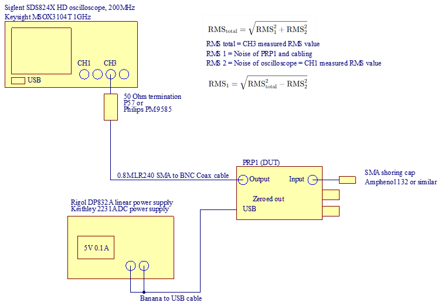
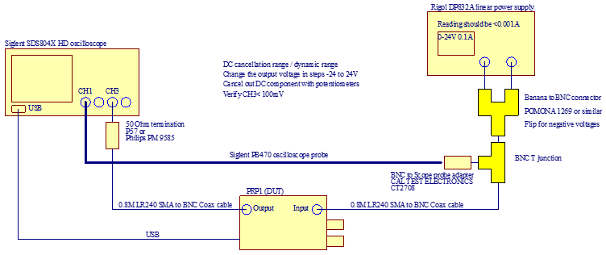
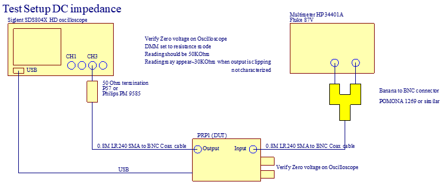

# Measurements done on the PRP1 Power rail probe
This documents lists all the measurements that are done on the PRP1 for design characterisation.\
The measurements were done on two separate units, results are published in folders
## 1) Bode plot 10MHz
Verifies the gain errors across the frequency span\

\

Equipment used:
* Siglent SDS804X HD Oscilloscope
* Siglent SDG1032X HD Generator

Settings:
* 10Hz to 10MHz
* 10 point/decade
* 100mV peak to peak
* 0V offset
* Frequency mode: Linear
* DUT input CH1
* DUT output CH3
* Load 50 Ohm 

Pass criteria: 1dB maximum deviation between minimum and maximum of the gain plot
Note: Crossover frequency is ~ 100 KHz\
Note: 1.3:1 is 0.77 or -2dB

## 2) AC gain @ 10 MHz
Verifies the 1.3:1 probe attenuation\

Equipment used:
* Siglent SDS804X HD Oscilloscope
* Siglent SDG1032X HD Generator

Settings on generator:
* 10MHz sine wave
* 100mV peak to peak
* 0V offset
* Load 50 Ohm 
* Using 1:1 setting on the PRP1

Pass criteria: 5% maximum deviation between RMS and Peak to peak value of CH1 and CH3\

## 3) Noise measurement 20MHz BW 12 bit Scope
Verifies the noise figure of the PRP1\

Settings:
* PRP1 zeroed-out
* PRP1 powered by lab linear power supply
* PRP1 input shorted by SMA shoring plug or 50Ohm load
* 2 mV/div on CH1 
* 1:1 probe on CH1
* CH1 terminated with a 50 Ohm terminator
* 2.6 mV/div on CH3
* 1.3:1 probe on CH3
* 1 ms/div time scale
* 20MHz bandwidth limit

Pass criteria: 
$\ Noise = sqrt{CH3^2 - CH1^2) < 50uV$

## 4) DC gain
Verifies the 1.3:1 probe attenuation on DC\

Equipment used:
* Siglent SDS804X HD Oscilloscope
* Siglent SDG1032X HD Generator

Settings:
* PRP1 zeroed out on Oscilloscope with 0V input
* 10 Hz square wave
* 100mV peak to peak
* 0V offset

Pass criteria: 
Measured 100mV peak to peak on the oscilloscope on CH1 and CH3\
Two measurements are 5% within each other

## 5) Cancellation range +24V and -24V
Verifies the +/-24V Cancellation range of the PRP1\

Equipment used: 
* Siglent SDS804X HD Oscilloscope
* Rigol DP832 Power supply

Settings:
* PRP1 zeroed-out after each change of the voltage on power supply
* Set up 5V, 12V, 24V with 0.1A current limit on power supply
* Flip BNC to banana adapter and repeat measurement

Pass criteria: 
PRP1 can be adjusted to less than 100mV measured on the oscilloscope
Output current of the power supply is less than 1mA

## 6) 500mV dynamic range
Verifies the active signal range of the PRP1\

Equipment used:
* Siglent SDS804X HD Oscilloscope
* Siglent SDG1032X HD Generator

Settings:
* PRP1 zeroed out on Oscilloscope with 0V input
* 10 KHz square wave
* 500mV peak to peak
* 0V offset

Pass criteria: 
Measured 500mV peak to peak on the oscilloscope

## 7) DC input 50KOhm
Verifies the 50KOhm input impedance in DC conditions of the PRP1\

Equipment used:
* Siglent SDS804X HD Oscilloscope
* HP 34401A multimeter

Settings:
* PRP1 zeroed out on Oscilloscope with 0V input
* resistance measurement auto range 

Pass criteria: 
50Kohm +/- 2% measured on DMM

## 8)a VNA bandwidth 10MHz-3 GHz 
Verifies the minimum 2 GHz bandwidth of the PRP1\

Equipment used: 
* LiteVNA
* Rigol DP832 Power supply
* MegiQ VNA calibration kit
* LiteVNA SS405 Coax cables

Settings:
* 10 MHz to 3 GHz sweep

Pass criteria: 1dB maximum deviation between minimum and maximum of S12 up to 2 GHz\
Nominal gain is -2dB +/- 1dB\
Note: 1.3:1 is 0.77 or -2dB

## 8)b VNA bandwidth 400MHz-3 GHz 2nd setup
Verifies the minimum 2 GHz bandwidth of the PRP1 with a more accurate VNA\

Note: Minimum frequency setting of the VNA is 400 MHz\
Equipment used:
* MegiQ VNA-0440e
* Rigol DP832 Power supply
* MegiQ VNA calibration kit
* LiteVNA SS405 Coax cables

Settings:
* 400 MHz to 3 GHz sweep
* S11,S12 measured

Pass criteria: 1dB maximum deviation between minimum and maximum of S12 up to 2 GHz\
Nominal gain is -2dB +/- 1dB

## 9) S parameters

Equipment used: 
* LiteVNA
* Rigol DP832 Power supply
* MegiQ VNA calibration kit
* LiteVNA SS405 Coax cables
Settings:
* 10 MHz to 3 GHz sweep

Pass criteria: None
S parameters provided for reference

## 10) 50 Ohm loading at high freqency, VSWR

Equipment used: 
* MegiQ VNA-0440e
* Rigol DP832 Power supply
* MegiQ VNA calibration kit
* LiteVNA SS405 Coax cables

Pass criteria: VSWR < 1.5 up to 2 GHz\
This is equivalent to Return loss < -13dB\
Or capacitive loading of ~ 0.5pF

## 11) Noise measurement 1GHz BW 8 bit scope
Verifies the high freqency noise content of the PRP1\

\

2 GHz scope should be used for ideal conditions, but I don't have access to one\
Equipment used: 
* Keysight MSOX 3104T Oscilloscope
* Keithley 2221A Power supply
Settings:
* PRP1 zeroed-out
* PRP1 powered by lab linear power supply
* PRP1 input shorted by SMA shoring plug or 50Ohm load
* 2 mV/div on CH1 
* 1:1 probe on CH1
* 2.6 mV/div on CH3
* 1.3:1 probe on CH3
* 20 us/div time scale to get the full samplerate and bandwidth
* 50 Ohm input CH1 and CH3

Pass criteria: 
TBD

## 12) Power consumption

Equipment used: 
* Siglent SDS804X HD Oscilloscope
* Rigol DP832 Power supply

Settings:
* 5V, 0.1A
* PRP1 zeroed-out

Pass criteria:
Power consumption less than 20mA
